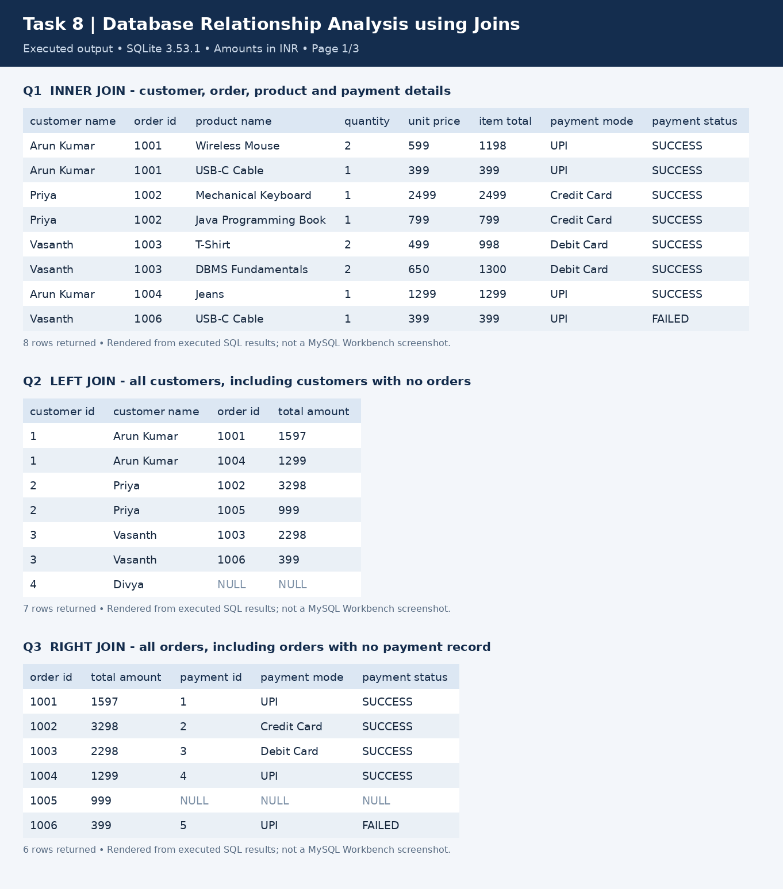
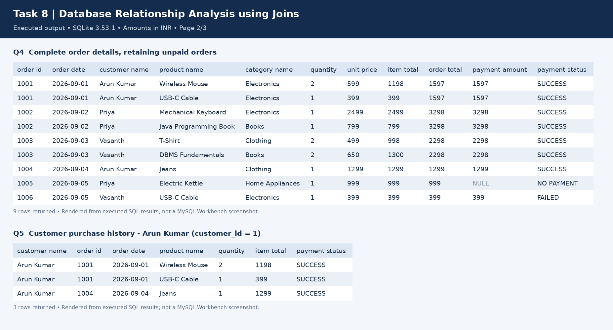
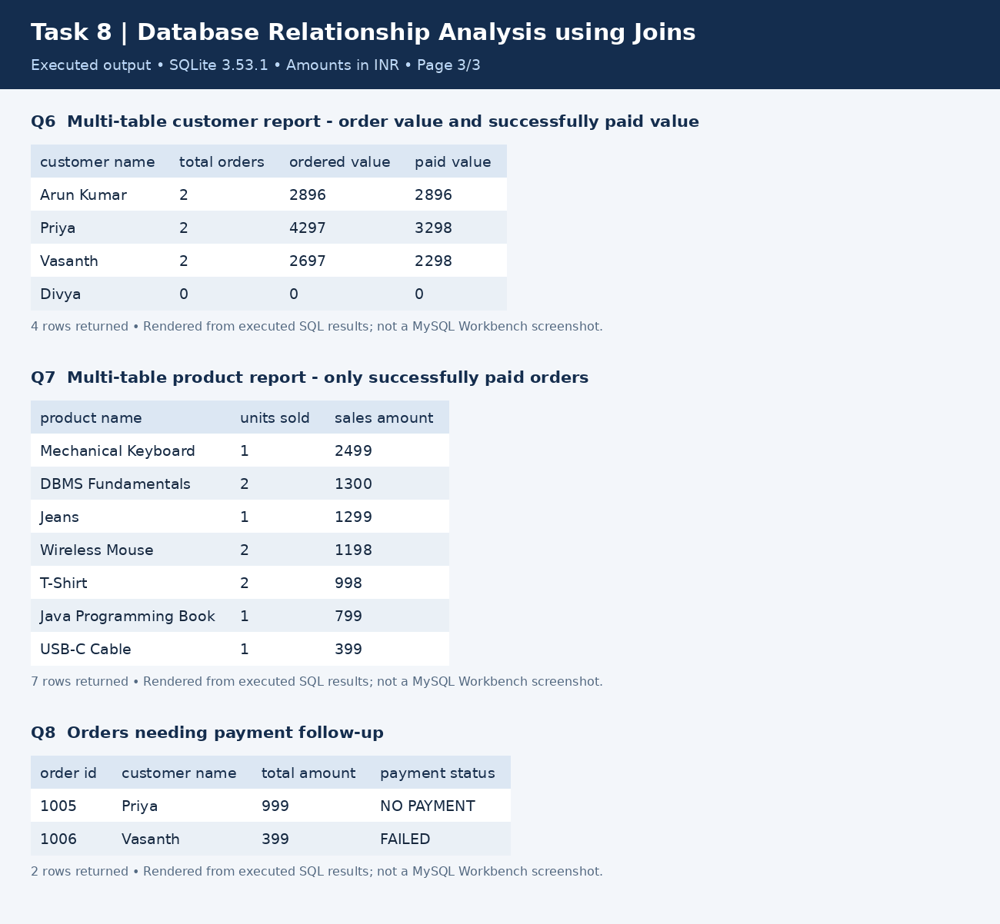

# Task VIII — Database Relationship Analysis using Joins

## Objective
Combine related e-commerce tables using joins, retrieve complete order details, display customer purchase history and generate multi-table reports.

**SQL file:** [database_relationship_joins.sql](database_relationship_joins.sql)

## Requirements Covered
| Requirement | Implementation |
| --- | --- |
| Combine Customer, Product, Order and Payment tables | Q1 and Q4, through Order_Details |
| INNER JOIN, LEFT JOIN and RIGHT JOIN | Q1, Q2 and Q3 |
| Complete order details | Q4 includes products, categories, quantities, prices and payment status |
| Customer purchase history | Q5; change customer_id to search another customer |
| Multi-table reports | Q6 customer summary, Q7 paid product sales, Q8 payment follow-up |

## Join Meaning
- INNER JOIN returns matching records from both tables.
- LEFT JOIN keeps all records from the left table, even without a match.
- RIGHT JOIN keeps all records from the right table, even without a match.

Q1 includes FAILED payment records because an INNER JOIN checks matching IDs, not payment success. Q4 repeats order/payment totals per item for display only. Q6 aggregates at order level to avoid counting those totals more than once.

## Database and Sample Data
The script creates a separate database and uses the naming conventions from earlier tasks: `Category`, `Customers`, `Products`, `Orders`, `Order_Details` and `Payment`.

Sample data: 4 customers, 4 categories, 8 products, 6 orders, 9 order items and 5 payment records. All records are fictional. Divya has no orders; order 1005 has no payment record; order 1006 has a failed payment. Home Appliances has no paid sales.

The simplified payment model allows one payment record per order (`order_id UNIQUE`). SUCCESS means fully paid. Partial payments, repeated payment attempts, refunds, taxes and shipping are outside this example. Sales use historical `unit_price` from order items, not the current catalogue price. Order totals are never summed after joining to multiple order-item rows.

## How to Run in MySQL
1. Open MySQL Workbench and connect to your MySQL 8.0.16+ server.
2. Open the SQL file linked above and run the full script once.
3. To repeat queries, execute the `USE` statement and only the numbered queries below `QUERY SECTION`.

The scripts create new databases (`amazon_task8` / `amazon_task9`) and contain no DROP statements. If a database already exists, rerun only its queries or choose a different name in CREATE DATABASE and USE.

## Output and Verification
All queries were executed using SQLite 3.53.1 with foreign keys enabled. MySQL-specific CREATE DATABASE and USE statements were skipped. The SELECT queries, including RIGHT JOIN, ran as written. A native MySQL run was not available.

- [Full query outputs](outputs.md): SQL and all returned rows.
- [Verification script](verify.py): run `python verify.py` with Python and SQLite 3.39+ to regenerate the text output and verify totals and edge cases.
- The PNGs below render the actual executed results. They are output images, **not MySQL Workbench screenshots**. NULL indicates no matching record.

## Output Images
### INNER, LEFT and RIGHT JOIN

### Complete Order Details and Purchase History

### Multi-table Reports

## Result
Implemented all three join types and verified customer purchase history, complete order details, paid product sales and missing/failed payment reports.
